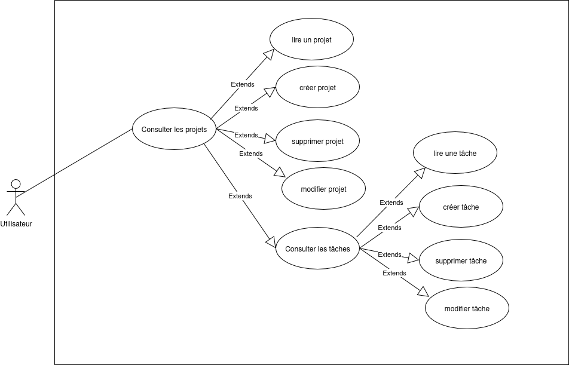
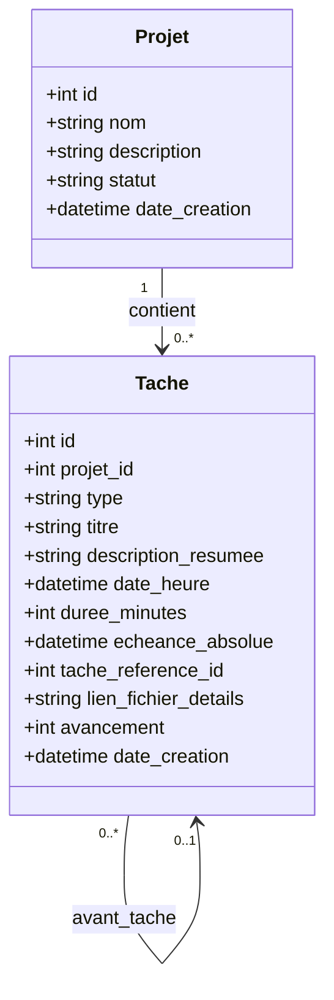

# Gestion projet

## Contexte

- Application mono-utilisateur destinée à un professeur
- Gestion de plusieurs types de projets :
  - Un projet par classe enseignée
  - Projets annexes (side projects, activités extra-scolaires, recherche, etc.)
- Chaque projet comprend :
  - Des cours planifiés à dates déterminées
  - Des réunions
  - Des tâches associées avec échéances

## Besoin

- Gestion centralisée de tous les projets pédagogiques et annexes
- Plusieurs projets avec :
  - Description
  - Échéance globale du projet
- Plusieurs éléments par projet :
  - **Cours** : événements planifiés à date/heure fixes
  - **Réunions** : rendez-vous avec date/heure déterminées
  - **Tâches** : actions à réaliser avec :
    - Type : action ou rendez-vous
    - Échéance : deadline absolue OU relative (avant un cours/réunion spécifique)
    - Description résumée
    - Lien vers un fichier de détails (spécifications complètes)
    - Date/heure de début
    - État d'avancement

## Objectifs

- Centraliser la gestion de tous les projets pédagogiques (classes) et annexes
- Planifier et suivre les cours, réunions et tâches associées
- Visualiser rapidement l'organisation temporelle de tous les projets
- Identifier les tâches à réaliser prochainement et les échéances critiques
- Faciliter la préparation des cours en liant les tâches aux événements
- Intégrer une assistance IA pour la gestion et la priorisation des tâches
- Préparer l'intégration future d'un serveur MCP (Model Context Protocol) pour une gestion assistée par IA

## Fonctions principales

### Gestion des projets
- Créer/modifier/supprimer des projets (classes et side projects)
- Définir la description et l'échéance globale de chaque projet

### Gestion des cours et réunions
- Planifier des cours avec date et heure fixes
- Planifier des réunions
- Visualiser le calendrier des événements

### Gestion des tâches
- Créer/modifier/supprimer des tâches associées à un projet
- Définir des échéances absolues ou relatives (avant un cours/réunion)
- Ajouter une description résumée et un lien vers un fichier de détails
- Suivre l'état d'avancement des tâches

### Visualisation
- Interface graphique simple organisée en colonnes par projet
- Affichage des tâches ordonnées chronologiquement par date
- Vue d'ensemble permettant d'identifier rapidement les priorités
- Consultation rapide des tâches à réaliser prochainement

### Intégration IA (future)
- Serveur MCP pour gérer les projets et tâches via une IA
- Assistance à la priorisation et à la planification
- Suggestions contextuelles basées sur l'historique

## Contraintes techniques

- base de données SQLITE
- utilisation d'une IA
- programmation en python
- 

## Liste matériel et logiciels mis en oeuvre

## Cas d'utilisation

## Synoptique

## Data Model

### Notes sur le modèle

- **Projet** : Représente une classe enseignée ou un projet annexe
  - `statut` : "ouvert" ou "fermé" (remplace la notion d'échéance globale)

- **Tache** : Représente tous les types d'éléments d'un projet
  - `type` : définit la nature de la tâche
    - **"cours"** : événement pédagogique planifié
    - **"reunion"** : rendez-vous
    - **"action"** : action à réaliser
  - **Champs communs** :
    - `titre` : titre de la tâche/cours/réunion
    - `description_resumee` : description courte
    - `date_heure` : date et heure de l'événement ou de début de la tâche
    - `duree_minutes` : durée (principalement pour cours et réunions)
    - `avancement` : pourcentage de complétion (0-100, surtout pour les actions)
  - **Échéances** :
    - `echeance_absolue` : deadline fixe (nullable si échéance relative)
    - `tache_reference_id` : référence vers une autre tâche (cours/réunion) pour échéance relative
      - Permet de définir qu'une tâche doit être terminée "avant le cours du 15 mars"
  - `lien_fichier_details` : chemin vers fichier contenant les détails complets

